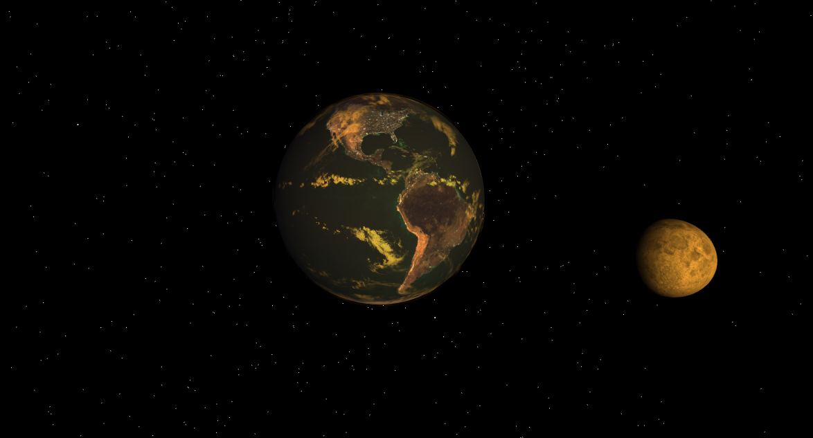

Team Performance Tracker  

🔗 [Live Demo](https://mrkweb15.github.io/earthSimulation/)
: Texture reference🔗 [mrdoob](https://github.com/mrdoob/three.js/tree/dev/examples/textures/planets)

Earth, Moon and Sun visualization using HTML and JavaScript

## ✨ Features  
- ✅ earth and Moon rotation and revolution.
- ✅ uses earth and moon shaders from
